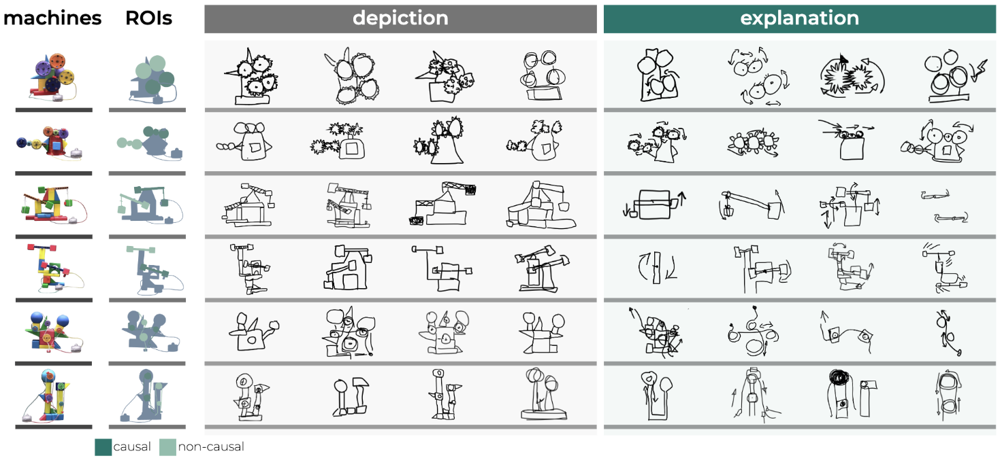
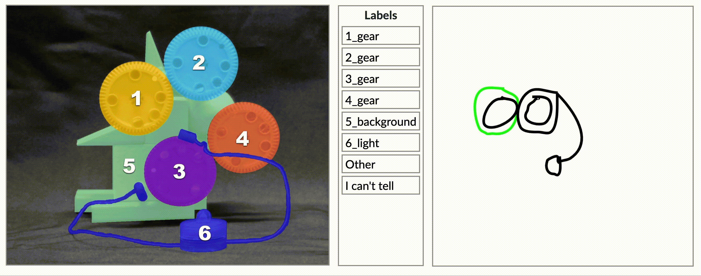
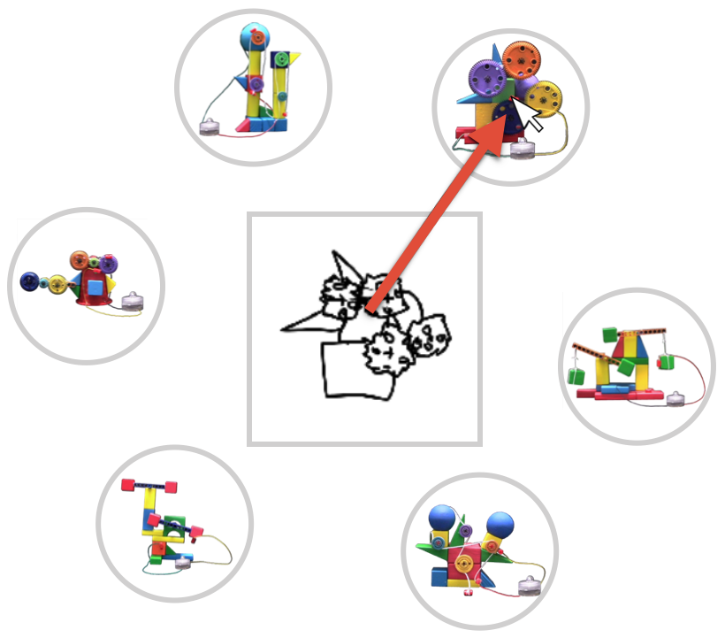
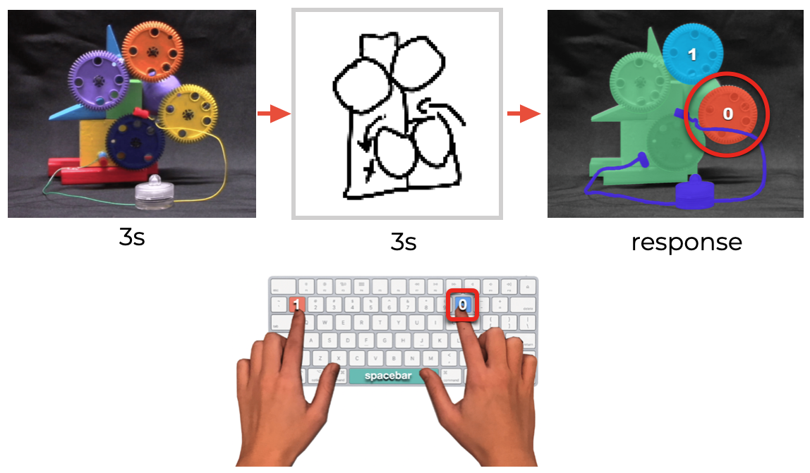

# How do semantic properties of visual explanations guide causal inferences?

How do we communicate our abstract knowledge to others? This project investigates the semantic differences between visual explanations and depictions.

  </img>

## Drawing experiments

### Visual production experiment

We developed a web-based drawing platform in which participants were presented with a series of video demonstrations showing a 6 different novel machines and asked to produce two kinds of drawings: 
on <i>explanation</i> trials, they were prompted to produce visual explanations that would help a naive viewer learn how the machine functioned in order to operate it; 
on <i>depiction</i> trials, they were prompted to produce visual depictions that would help a naive viewer identify the machine by its appearance. 

Participants used their cursor to draw in black ink on a dig-ital canvas embedded in their web browser (canvas = 500 x500px; stroke width = 5px). 
Each stroke was rendered in realtime on the participant’s screen as they drew and could not be deleted once drawn. 
The digital canvas was generated using [Paper.js](http://paperjs.org/). 

This and all subsequent experiments were custom coded using plugins from [jsPsych](https://www.jspsych.org/).

#### Where to find the experiment
- `/experiments/visual_production`

#### Analysis
- `/experiments/visual_production/analysis/` contains analysis scripts (in particular, task performance is analyzed in `causaldraw_analysis_cogsci.rmd`. Here we analyzed how many strokes and how long participants spent drawing in each condition.
- `/analysis/utils/` contains helper functions

#### Data
- `/analysis/results/csv/` contains preprocessed and anonymized CSVs for all participants

### Semantic annotations experiment

To measure  the  semantic  content  that  might  distinguish  visual explanations from depictions, we crowdsourced annotations of the drawings. 
For each stroke in every drawing, annotators provided a label that described how they interpreted the stroke to correspond to elements in the target machine (e.g., “gear”, “lever”, “back-ground”).
To assist annotators with identifying specific elements of the machines, they were provided a reference image.
This reference image was generated by taking a static photograph of the machines in the original video demonstrations. Each element of the machines was color-coded and numbered for easy identification. 

  </img>

#### Where to find the experiment
- `/experiments/semantic_annotations`

#### Analysis
- `/experiments/semantic_annotations/analysis/` contains analysis scripts (in particular, `causaldraw_annotations_cogsci.rmd` explores how people assigned labels to different strokes.)
- `/analysis/utils/` contains helper functions

#### Data
- `/analysis/results/csv/` contains preprocessed and anonymized CSVs for all participants

## Downstream behavioral experiments
A critical test of how useful such communicative strategies are is to evaluate how well other people can interpret these drawings to achieve their own behavioral goals. 

### Identification experiment
Here we tested how well naive viewers could use the collected visual explanations and depictions to quickly and accurately identify the referent of the drawing (i.e., which original machine that drawing represented). In this experiment, participants placed their cursor at the center of their screen (at a crosshair) and were presented with a circular array of photographs of the original machines. When a sketch appeared at the center of the array, participants were tasked to click on the machine that drawing represented.

  </img>

#### Where to find the experiment
- `/experiments/identification`

#### Analysis
- `/experiments/identification/analysis/` contains analysis scripts (in particular, task performance is analyzed in `causaldraw_identification_cogsci.rmd`. Here we analyzed response time and accuracy.)
- `/analysis/utils/` contains helper functions

#### Data
- `/analysis/results/csv/` contains preprocessed and anonymized CSVs for all participants

### Causal intervention experiment
Here we tested how well naive viewers could use the collected visual explanations and depictions to quickly and accurately infer which element to intervene on to produce an effect (i.e., which part of the machine to manipulate to activate the light bulb).
In this experiment, participants placed their fingers on the "0" and "1" keys of their keyboard. They studied a photograph of a machine for 3 seconds and then were presented with a drawing of the machine for another 3 seconds. After this time, they were presented with a reference image and were asked to press the key that corresponded to the part of the machine that they would intervene on to activate the light bulb <i>based on their interpretation of the drawing</i>. 

  </img>

#### Where to find the experiment
- `/experiments/intervention`

#### Analysis
- `/experiments/intervention/analysis/` contains analysis scripts (in particular, task performance is analyzed in `causaldraw_intervention_cogsci.rmd`. Here we analyzed response time and accuracy.)
- `/analysis/utils/` contains helper functions 

#### Data
- `/analysis/results/csv/` contains preprocessed and anonymized CSVs for all participants
